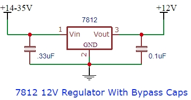
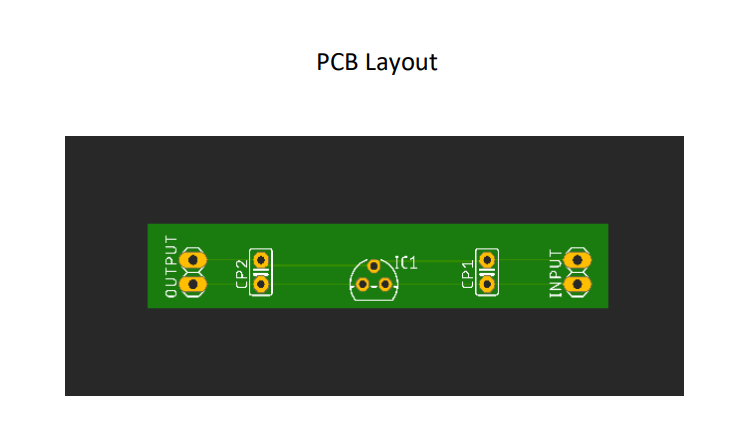
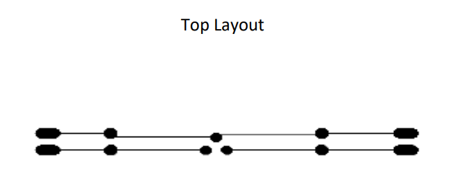
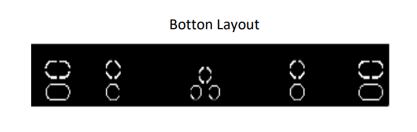
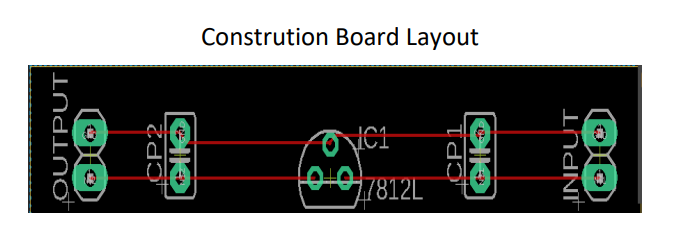

# Voltage Regulator - Eagle Software Based PCB Designing

This repository contains the design files and documentation for a 12V DC voltage regulator power supply PCB, created using Eagle software. The project is based on the LM7812 IC and was developed as part of a workshop practical at Datta Meghe College of Engineering.

## Circuit Design
### Schematic
The circuit uses the LM7812 voltage regulator IC with input and output capacitors for filtering.

### Pin Diagram
LM7812:
- Pin 1: +Vin
- Pin 2: +Vout
- Pin 3: GND

 

## Components List
| Sr. No. | Component          | Specification                          |
|---------|--------------------|----------------------------------------|
| 1      | LM7812 x1         | Output current: 1.5A, Fixed 12V output, Max input voltage: 35V DC |
| 2      | 1000µF / 25V M.R | Electrolytic capacitor, 1000µF, Voltage: 25V |
| 3      | 9V Battery x2     | Nominal voltage: 9V, Discharge resistance: 620Ω, Cut-off voltage: 5.4V |
| 4      | Multimeter x1     | For voltage and current measurement   |

## Working Principle and Procedure
The LM7812 is an integrated circuit widely used in 12V voltage regulator circuits. It requires only two capacitors (optional) to achieve a clean voltage output.

- **Procedure**:
  - Use capacitors to filter the input and output.
  - Mount the 7812 on a heatsink for 1A current to prevent overheating.
  - Pins: Vin (connect to 15V-35V battery), GND (connect negative ends of capacitors), Vout (measure with multimeter set to 20V DC).
  - The circuit provides short-circuit and overheat protection.

- **Power Dissipation Calculation**:
  Power Dissipation = (Vin - Vout) × Iout  
  Example: For Vin=15V, Iout=1A: (15V - 12V) × 1A = 3W.  
  A heatsink is required for >1-1.25W dissipation. Without it, max current is ~300-350mA, and the device may run at 85-95°C.

- **General Rule**: Use the lowest possible input voltage to minimize power loss and maximize output current.

## PCB Layouts

### Top Layout
 

### Bottom Layout
 

### Construction Board Layout
 

## Conclusion
The LM7812 voltage regulator IC does not require additional components to balance or saturate its output voltage. It has built-in protection against high current, includes a heatsink connected to the common ground, prevents overheating and short-circuits, and provides a constant 12V DC voltage.

## Applications
1. Voltage step-down circuits
2. 12V power supplies
3. Motor drivers
4. Battery chargers
5. Solar power supplies
6. Micro-controller related applications

## Result
Stable 12V DC output achieved using IC7812.

## Files in This Repo
- `docs/EL_15_Workshop_practical.pdf`: Original workshop report.
- `eagle/`: Schematic (.sch) and board (.brd) files (add if available).
- `gerbers/`: Manufacturing files (export from Eagle).
- `images/`: Diagrams and layouts.

## How to Replicate
1. Open the .sch file in Eagle to view/edit the schematic.
2. Switch to board view (.brd) for layout.
3. Export Gerbers for PCB fabrication (e.g., via JLCPCB or PCBWay).
4. Assemble components as per the layout.

## License
MIT License - Feel free to use and modify.

If you have questions or improvements, open an issue!
